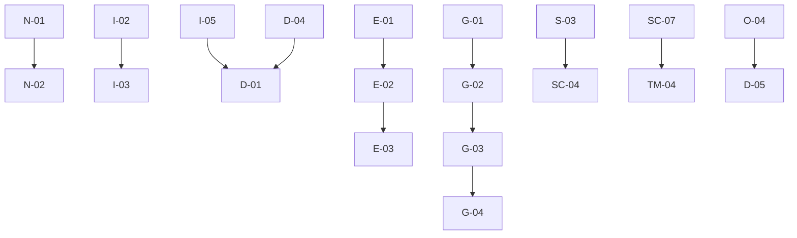

# MCPServer OS — Project Tracker

**Repository:** `CodesbyFebin/Indian-MCP-Server`
**Branch:** `kilo/orbital-eagle-zbx`
**Target:** `app.mcpserver.in`
**Doctrine:** Evidence-First AI Infrastructure Control Plane
**Mission:** Evolve into an evidence-first, multi-tenant MCP infrastructure operating system.

---

## 🔄 Release Trains
- **R1: Sovereign Core** (Tenancy, RBAC, Deployment, Gateway, Evidence)
- **R2: Governance** (Policies, Incident, GitOps)
- **R3: Intelligence** (Healing, MCP Doctor)
- **R4: Ecosystem** (Marketplace, Billing)

## Phase 0: Repository Forensics (Completed)
| ID | Feature | Build | Test | Runtime | Prod | Notes |
|----|---------|-------|------|---------|------|-------|
| PH0-01 | Repository Audit | 🟢 | 🟢 | ⚪ | ⚪ | Baseline report: reports/00-BASELINE.md |
| PH0-02 | Gap Analysis | 🟢 | 🟢 | ⚪ | ⚪ | Gap matrix: reports/00-GAP-MATRIX.csv |
| PH0-03 | Project Tracker Init | 🟢 | ⚪ | ⚪ | ⚪ | This file |

## Phase 1: Repository Normalization
| ID | Feature | Build | Test | Runtime | Prod | Priority | Notes |
|----|---------|-------|------|---------|------|----------|-------|
| N-01 | Structure Cleanup | 🔵 | ⚪ | ⚪ | ⚪ | P0 | Normalize to apps/services/packages |
| N-02 | Lint/Typecheck Pass | ⚪ | ⚪ | ⚪ | ⚪ | P1 | |
| N-03 | Build Pass | ⚪ | ⚪ | ⚪ | ⚪ | P1 | |

## Phase 2: Identity + Tenancy Foundation
| ID | Feature | Build | Test | Runtime | Prod | Priority | Notes |
|----|---------|-------|------|---------|------|----------|-------|
| I-01 | Users & Authentication | ⚪ | ⚪ | ⚪ | ⚪ | P0 | JWT-based auth |
| I-02 | Organizations & Workspaces | ⚪ | ⚪ | ⚪ | ⚪ | P0 | Multi-tenant isolation |
| I-03 | Roles & Permissions (RBAC) | ⚪ | ⚪ | ⚪ | ⚪ | P0 | Granular permissions |
| I-04 | API Tokens & Sessions | ⚪ | ⚪ | ⚪ | ⚪ | P1 | |
| I-05 | Cross-Tenant Isolation (RLS) | ⚪ | ⚪ | ⚪ | ⚪ | P0 | PostgreSQL Row Level Security |

## Phase 3: MCPserver.in Trust Bridge
| ID | Feature | Build | Test | Runtime | Prod | Priority | Notes |
|----|---------|-------|------|---------|------|----------|-------|
| T-01 | Registry Client Package | ⚪ | ⚪ | ⚪ | ⚪ | P1 | packages/registry-client |
| T-02 | Signed Deployment Intent | ⚪ | ⚪ | ⚪ | ⚪ | P1 | |
| T-03 | Provenance Validation | ⚪ | ⚪ | ⚪ | ⚪ | P1 | |
| T-04 | Human Approval Workflow | ⚪ | ⚪ | ⚪ | ⚪ | P1 | |

## Phase 4: Deployment Engine
| ID | Feature | Build | Test | Runtime | Prod | Priority | Notes |
|----|---------|-------|------|---------|------|----------|-------|
| D-01 | Deployment Model | ⚪ | ⚪ | ⚪ | ⚪ | P0 | State machine model |
| D-02 | Artifact Resolution | ⚪ | ⚪ | ⚪ | ⚪ | P0 | |
| D-03 | Approval Gate Integration | ⚪ | ⚪ | ⚪ | ⚪ | P0 | |
| D-04 | Docker Runtime Provider | ⚪ | ⚪ | ⚪ | ⚪ | P0 | Start with Docker only |
| D-05 | Deployment Events & History | ⚪ | ⚪ | ⚪ | ⚪ | P1 | |

## Phase 5: Gateway
| ID | Feature | Build | Test | Runtime | Prod | Priority | Notes |
|----|---------|-------|------|---------|------|----------|-------|
| G-01 | MCP Transport Layer | ⚪ | ⚪ | ⚪ | ⚪ | P0 | Streamable HTTP, SSE, stdio |
| G-02 | Authentication & Tenant Resolution | ⚪ | ⚪ | ⚪ | ⚪ | P0 | JWT, API tokens |
| G-03 | JSON-RPC Validation | ⚪ | ⚪ | ⚪ | ⚪ | P0 | Request/response validation |
| G-04 | Tool Policy Engine | ⚪ | ⚪ | ⚪ | ⚪ | P0 | Allow/deny/monitor |
| G-05 | Rate Limiting & Timeouts | ⚪ | ⚪ | ⚪ | ⚪ | P1 | |
| G-06 | Audit Correlation & Tracing | ⚪ | ⚪ | ⚪ | ⚪ | P1 | |

## Phase 6: Secret Vault
| ID | Feature | Build | Test | Runtime | Prod | Priority | Notes |
|----|---------|-------|------|---------|------|----------|-------|
| S-01 | Secret Provider Interface | ⚪ | ⚪ | ⚪ | ⚪ | P1 | Provider-neutral |
| S-02 | Encrypted Local Provider (Dev) | ⚪ | ⚪ | ⚪ | ⚪ | P1 | |
| S-03 | Vault/External Provider Integration | ⚪ | ⚪ | ⚪ | ⚪ | P0 | HashiCorp Vault / AWS Secrets |
| S-04 | Secret Rotation & Revocation | ⚪ | ⚪ | ⚪ | ⚪ | P1 | |
| S-05 | Secret Access Auditing | ⚪ | ⚪ | ⚪ | ⚪ | P1 | |

## Phase 7: Evidence Ledger ⚠️ P0 GAP
| ID | Feature | Build | Test | Runtime | Prod | Priority | Notes |
|----|---------|-------|------|---------|------|----------|-------|
| E-01 | Evidence Artifact Model | 🟢 | ⚪ | ⚪ | ⚪ | **P0** | Schema created: packages/evidence/src/types.ts |
| E-02 | Hash Chain Implementation | 🟢 | ⚪ | ⚪ | ⚪ | **P0** | SHA-256 chain + canonical serialization |
| E-03 | Evidence Collection & Storage | ⚪ | ⚪ | ⚪ | ⚪ | **P0** | |
| E-04 | Evidence Review & Verification | ⚪ | ⚪ | ⚪ | ⚪ | P1 | |
| E-05 | Control Mapping Framework | ⚪ | ⚪ | ⚪ | ⚪ | P1 | |
| E-06 | Evidence Package Generation | ⚪ | ⚪ | ⚪ | ⚪ | P1 | |

## Phase 8: India Evidence Pack
| ID | Feature | Build | Test | Runtime | Prod | Priority | Notes |
|----|---------|-------|------|---------|------|----------|-------|
| IN-01 | PII Redaction Engine | 🟢 | 🟡 | ⚪ | ⚪ | P0 | Implemented, needs testing |
| IN-02 | DPDP Technical Control Profile | ⚪ | ⚪ | ⚪ | ⚪ | P1 | Evidence, not compliance |
| IN-03 | RBI Technical Control Profile | 🟢 | ⚪ | ⚪ | ⚪ | **P0** | Phase 5.5 - 8 controls defined in types.ts |
| IN-04 | UIDAI Authorization Tracker | ⚪ | ⚪ | ⚪ | ⚪ | P1 | |
| IN-05 | UPI Sandbox Adapter | 🟢 | 🟡 | Sandbox | ⚪ | P0 | Implemented, needs testing |
| IN-06 | Tenant Residency Policy Engine | ⚪ | ⚪ | ⚪ | ⚪ | P1 | |
| IN-07 | IndiaAI Request Entitlement Tracker | ⚪ | ⚪ | ⚪ | ⚪ | P2 | |

## Phase 9: Observability
| ID | Feature | Build | Test | Runtime | Prod | Priority | Notes |
|----|---------|-------|------|---------|------|----------|-------|
| O-01 | OpenTelemetry Tracing | ⚪ | ⚪ | ⚪ | ⚪ | P1 | |
| O-02 | Structured Logging | ⚪ | ⚪ | ⚪ | ⚪ | P1 | |
| O-03 | Metrics Collection | ⚪ | ⚪ | ⚪ | ⚪ | P1 | |
| O-04 | Health & Readiness Checks | ⚪ | ⚪ | ⚪ | ⚪ | P1 | |
| O-05 | MCP Flow Visualization | ⚪ | ⚪ | ⚪ | ⚪ | P1 | |

## Phase 10: Security Center
| ID | Feature | Build | Test | Runtime | Prod | Priority | Notes |
|----|---------|-------|------|---------|------|----------|-------|
| SC-01 | MCP Endpoint Inventory | ⚪ | ⚪ | ⚪ | ⚪ | P1 | |
| SC-02 | Vulnerability Findings | ⚪ | ⚪ | ⚪ | ⚪ | P1 | |
| SC-03 | Policy Violations Tracking | ⚪ | ⚪ | ⚪ | ⚪ | P1 | |
| SC-04 | Secret Anomalies Detection | ⚪ | ⚪ | ⚪ | ⚪ | P1 | |
| SC-05 | Shadow MCP Detection | ⚪ | ⚪ | ⚪ | ⚪ | P1 | |
| SC-06 | Incident Tracking & Response | ⚪ | ⚪ | ⚪ | ⚪ | P0 | |
| SC-07 | Kill Switch Mechanisms | ⚪ | ⚪ | ⚪ | ⚪ | P0 | |

## Phase 11: MCP Time Machine
| ID | Feature | Build | Test | Runtime | Prod | Priority | Notes |
|----|---------|-------|------|---------|------|----------|-------|
| TM-01 | Versioned Deployments | ⚪ | ⚪ | ⚪ | ⚪ | P1 | |
| TM-02 | Compatibility Analysis | ⚪ | ⚪ | ⚪ | ⚪ | P1 | |
| TM-03 | Rollback Workflow | ⚪ | ⚪ | ⚪ | ⚪ | P1 | |
| TM-04 | Backup & Restore Checkpoints | ⚪ | ⚪ | ⚪ | ⚪ | P1 | |

## Phase 12: Self-Healing
| ID | Feature | Build | Test | Runtime | Prod | Priority | Notes |
|----|---------|-------|------|---------|------|----------|-------|
| SH-01 | Automatic Remediation | ⚪ | ⚪ | ⚪ | ⚪ | P1 | restart, replace, reschedule |
| SH-02 | Approved Runbook Execution | ⚪ | ⚪ | ⚪ | ⚪ | P1 | |
| SH-03 | AI-Based Recommendations | ⚪ | ⚪ | ⚪ | ⚪ | P2 | |
| SH-04 | Bounded Healing Policies | ⚪ | ⚪ | ⚪ | ⚪ | P1 | |

## Phase 13: Developer Experience
| ID | Feature | Build | Test | Runtime | Prod | Priority | Notes |
|----|---------|-------|------|---------|------|----------|-------|
| DX-01 | MCP Sandbox Environment | ⚪ | ⚪ | ⚪ | ⚪ | P1 | |
| DX-02 | Trace Viewer & Flow Debugger | ⚪ | ⚪ | ⚪ | ⚪ | P1 | |
| DX-03 | CLI (mcpserver) | ⚪ | ⚪ | ⚪ | ⚪ | P1 | |
| DX-04 | GitOps Integration | ⚪ | ⚪ | ⚪ | ⚪ | P2 | |

## Phase 14: Marketplace
| ID | Feature | Build | Test | Runtime | Prod | Priority | Notes |
|----|---------|-------|------|---------|------|----------|-------|
| MKT-01 | Publisher Management | ⚪ | ⚪ | ⚪ | ⚪ | P2 | |
| MKT-02 | Listing & Versioning | ⚪ | ⚪ | ⚪ | ⚪ | P2 | |

## Phase 15: Production Engineering
| ID | Feature | Build | Test | Runtime | Prod | Priority | Notes |
|----|---------|-------|------|---------|------|----------|-------|
| PE-01 | Docker & Compose | ⚪ | ⚪ | ⚪ | ⚪ | P1 | |
| PE-02 | Caddy Reverse Proxy | ⚪ | ⚪ | ⚪ | ⚪ | P1 | |
| PE-03 | Backup & Restore | ⚪ | ⚪ | ⚪ | ⚪ | P1 | |

## Phase 16: Master Reviewer
| ID | Feature | Build | Test | Runtime | Prod | Priority | Notes |
|----|---------|-------|------|---------|------|----------|-------|
| MR-01 | Final Production Approval | ⚪ | ⚪ | ⚪ | ⚪ | P0 | |

## Legend
- ⚪ NOT_STARTED
- 🔵 DESIGNED
- 🟡 IN_PROGRESS
- 🟢 VERIFIED
- 🔴 FAILED
- 🟣 BLOCKED

## Priority Classification
- **P0**: Must complete before any deployment
- **P1**: Should complete for next release
- **P2**: Nice to have for future releases

## Highest Priority Items (P0)
1. **N-01**: Repository Structure Cleanup (normalize to apps/services/packages)
2. **I-05**: Cross-Tenant Isolation with PostgreSQL RLS
3. **D-04**: Docker Runtime Provider
4. **G-01 through G-04**: MCP Gateway core components
5. **S-03**: Secret Vault with Vault/AWS integration
6. **E-03 through E-06**: Evidence Ledger storage, review, control mapping, package generation
7. **IN-03**: RBI Technical Control Profile (Phase 5.5) - Controls defined, implementation next

## Progress Summary
- ✅ Phase 0: Forensic audit completed (reports/00-BASELINE.md, reports/00-GAP-MATRIX.csv)
- ✅ Phase 7 (partial): Evidence Artifact Model + Hash Chain Implementation with TypeScript schema
- ✅ Phase 8 (partial): PII Redaction Engine (existing), UPI Sandbox Adapter (existing), RBI Control Profile (8 controls defined)
- ✅ Documentation: README.md, CONTRIBUTING.md, ARCHITECTURE.md, PROJECT-TRACKER.md
- ✅ Infrastructure: UPI Migration Guide, Staging Deployment Checklist

## Dependencies

## Next Actions
1. ✅ Complete Phase 0: Forensic baseline established
2. ✅ Create TypeScript schema for Evidence Ledger (Phase 7)
3. ✅ Define RBI Technical Control Profile with 8 controls (Phase 5.5/IN-03)
4. ✅ Create documentation set (README, CONTRIBUTING, ARCHITECTURE, trackers)
5. ⬜ Phase 1: Normalize repository structure (apps/services/packages)
6. ⬜ Create PR to trigger CI/CD checks
7. ⬜ Address remaining P0 gaps: Evidence Ledger storage, Gateway, DB Schema, Secret Vault
8. ⬜ Proceed with staging deployment validation using DEPLOYMENT_CHECKLIST_STAGING.md